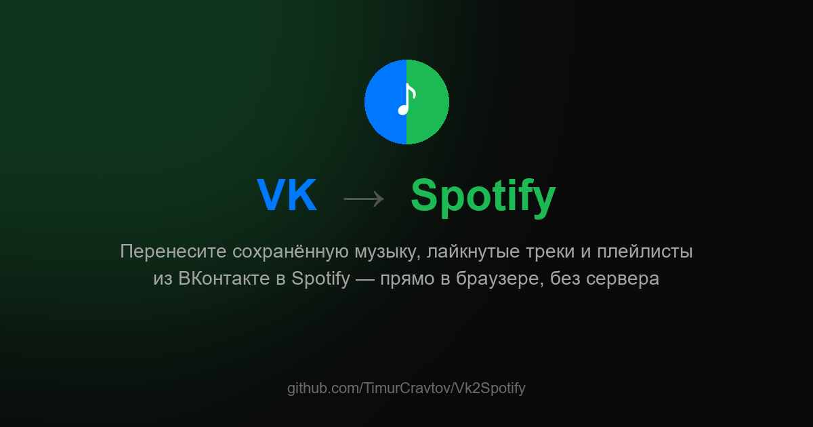
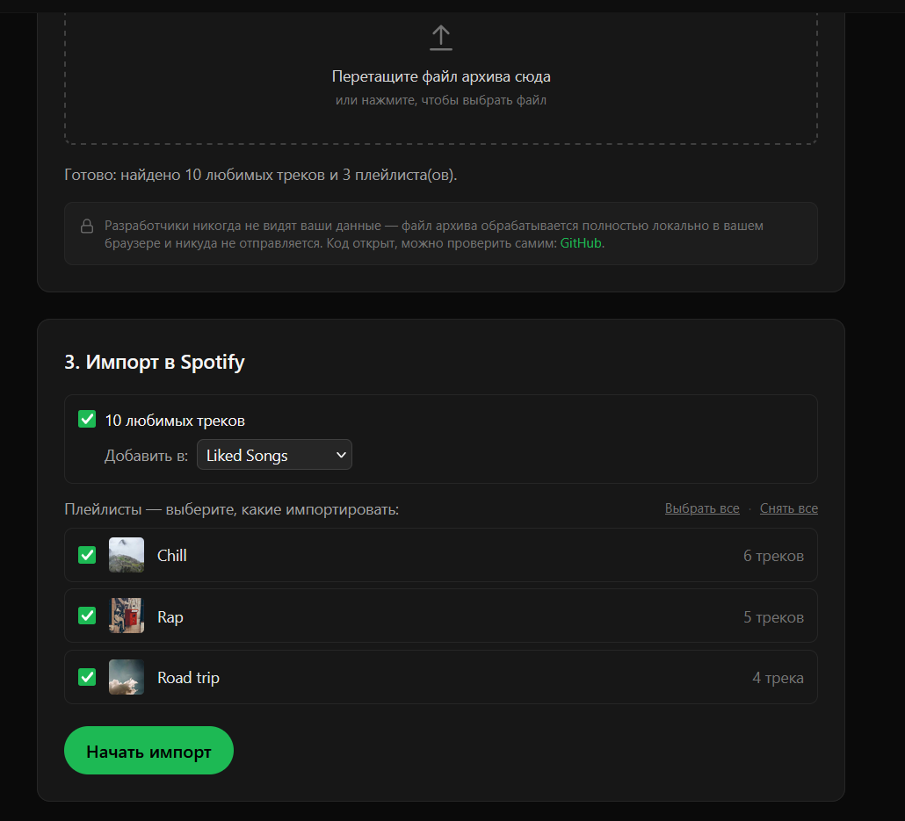
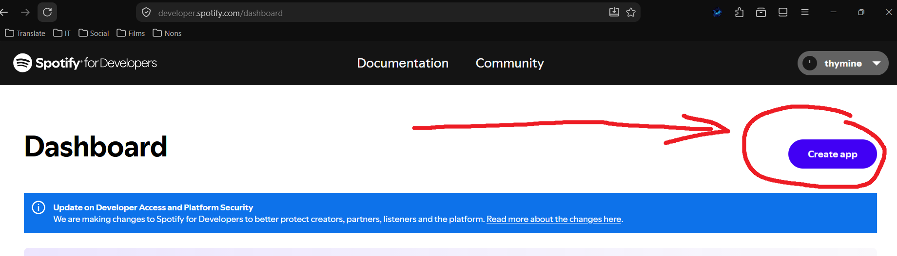
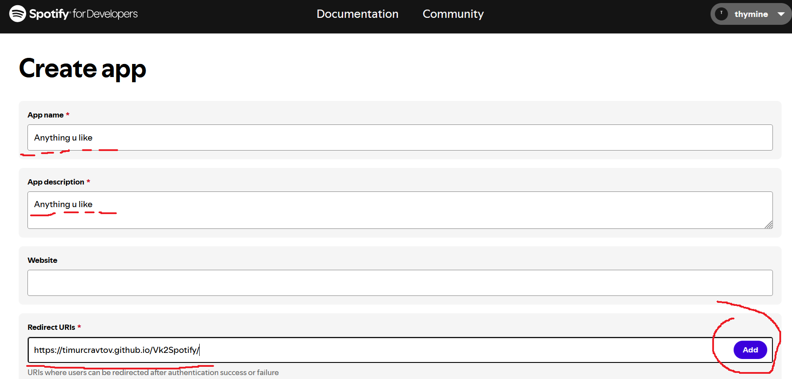
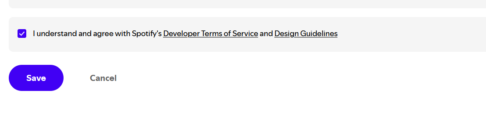
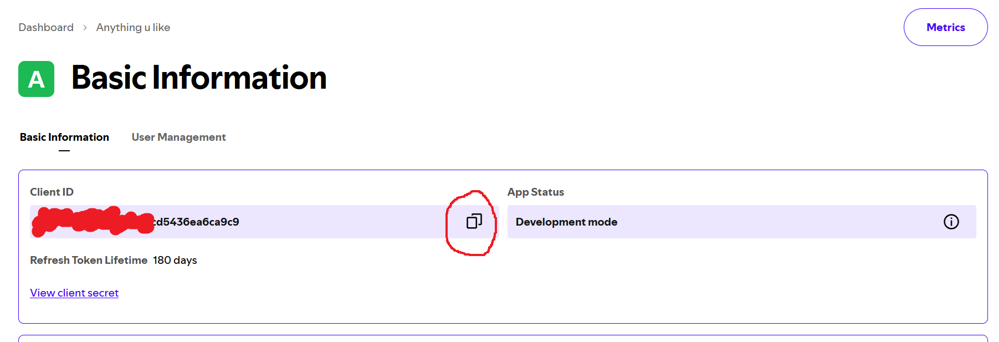
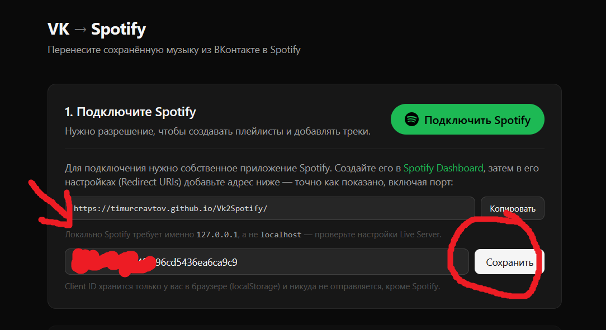

# Vk2Spotify

**[🇷🇺 Русский](#русский) | [🇬🇧 English](#english)**

---

## Русский

Веб-приложение для переноса сохранённой музыки из ВКонтакте в Spotify.
Загрузите архив данных ВКонтакте — приложение разберёт его и создаст плейлисты
и лайкнутые треки в вашем аккаунте Spotify. Весь разбор архива происходит
локально в браузере, ничьи данные никуда не отправляются, кроме Spotify.

- Открыть: `index.html`
- Требуется собственное приложение Spotify (Client ID) — создаётся в
  [Spotify Dashboard](https://developer.spotify.com/dashboard)

[↑ к выбору языка](#vk2spotify)

### Как создать Spotify-приложение и получить Client ID

1. Откройте [Spotify Dashboard](https://developer.spotify.com/dashboard) и нажмите **Create app**.

   

2. Заполните **App name** и **App description** (подойдёт любой текст), а в **Redirect URIs**
   вставьте адрес, который показывает сам Vk2Spotify в разделе «1. Подключите Spotify»
   (например, [https://timurcravtov.github.io/Vk2Spotify/](https://timurcravtov.github.io/Vk2Spotify/) —
   точно как показано, включая порт) и нажмите **Add**.

   

3. Отметьте согласие с Developer Terms of Service и Design Guidelines, затем нажмите **Save**.

   

4. На странице приложения (**Basic Information**) скопируйте **Client ID**.

   

5. Вставьте скопированный Client ID в Vk2Spotify и нажмите **Сохранить**.

   

Готово — можно нажимать «Подключить Spotify».

[↑ к выбору языка](#vk2spotify)

---

## English

A web app for migrating your saved music from VK (VKontakte) to Spotify.
Upload your VK data archive — the app parses it locally in your browser and
recreates your liked tracks and playlists on Spotify. No data ever leaves
your browser except calls to Spotify itself.

- Open: `index.html`
- Requires your own Spotify app (Client ID) — create one in the
  [Spotify Dashboard](https://developer.spotify.com/dashboard)

[↑ back to language selector](#vk2spotify)

### Creating a Spotify app and getting a Client ID

1. Open the [Spotify Dashboard](https://developer.spotify.com/dashboard) and click **Create app**.

   

2. Fill in **App name** and **App description** (anything works), and in **Redirect URIs**
   paste the address Vk2Spotify shows you in the "1. Подключите Spotify" section
   (e.g. [https://timurcravtov.github.io/Vk2Spotify/](https://timurcravtov.github.io/Vk2Spotify/) —
   exactly as shown, including the port), then click **Add**.

   

3. Check the box agreeing to the Developer Terms of Service and Design Guidelines, then click **Save**.

   

4. On the app's **Basic Information** page, copy the **Client ID**.

   

5. Paste the copied Client ID into Vk2Spotify and click **Сохранить**.

   

Done — you can now click "Подключить Spotify".

[↑ back to language selector](#vk2spotify)
